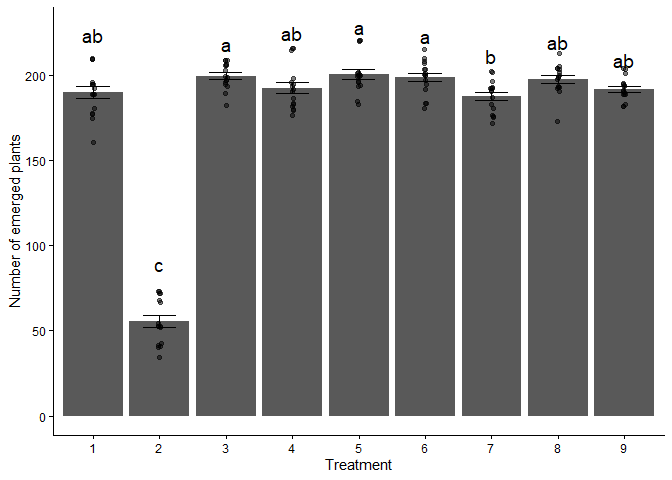

``` r
knitr::opts_chunk$set(echo = TRUE)
library(tidyverse)
library(ggplot2)
library(ggpubr)
library(knitr)
library(drc)
library(lme4)
library(emmeans)
library(multcomp)
library(multcompView)
```

# Question 1

## Read in the data called “PlantEmergence.csv” using a relative file path and load the following libraries. tidyverse, lme4, emmeans, multcomp, and multcompView. Turn the Treatment , DaysAfterPlanting and Rep into factors using the function as.factor

### See previous code section for loaded libraries.

``` r
PlantEmergence <- read.csv("PlantEmergence.csv")
head(PlantEmergence)
```

    ##   Plot Treatment Rep Emergence DatePlanted DateCounted DaysAfterPlanting
    ## 1  101         1   1     180.5    9-May-22   16-May-22                 7
    ## 2  102         2   1      54.5    9-May-22   16-May-22                 7
    ## 3  103         3   1     195.0    9-May-22   16-May-22                 7
    ## 4  104         4   1     198.5    9-May-22   16-May-22                 7
    ## 5  105         5   1     202.0    9-May-22   16-May-22                 7
    ## 6  106         6   1     184.0    9-May-22   16-May-22                 7

``` r
#saving columns into factors
PlantEmergence$Treatment <- as.factor(PlantEmergence$Treatment) 
PlantEmergence$DaysAfterPlanting <- as.factor(PlantEmergence$DaysAfterPlanting)
PlantEmergence$Rep <- as.factor(PlantEmergence$Rep)
```

# Question 2

## Fit a linear model to predict Emergence using Treatment and DaysAfterPlanting along with the interaction. Provide the summary of the linear model and ANOVA results.

``` r
lm.interaction.emergence <- lm(Emergence ~ Treatment * DaysAfterPlanting, data = PlantEmergence) #linear regression with interaction via *

summary(lm.interaction.emergence) #Model summary
```

    ## 
    ## Call:
    ## lm(formula = Emergence ~ Treatment * DaysAfterPlanting, data = PlantEmergence)
    ## 
    ## Residuals:
    ##     Min      1Q  Median      3Q     Max 
    ## -21.250  -6.062  -0.875   6.750  21.875 
    ## 
    ## Coefficients:
    ##                                  Estimate Std. Error t value Pr(>|t|)    
    ## (Intercept)                     1.823e+02  5.324e+00  34.229   <2e-16 ***
    ## Treatment2                     -1.365e+02  7.530e+00 -18.128   <2e-16 ***
    ## Treatment3                      1.112e+01  7.530e+00   1.477    0.142    
    ## Treatment4                      2.500e+00  7.530e+00   0.332    0.741    
    ## Treatment5                      8.750e+00  7.530e+00   1.162    0.248    
    ## Treatment6                      7.000e+00  7.530e+00   0.930    0.355    
    ## Treatment7                     -1.250e-01  7.530e+00  -0.017    0.987    
    ## Treatment8                      9.125e+00  7.530e+00   1.212    0.228    
    ## Treatment9                      2.375e+00  7.530e+00   0.315    0.753    
    ## DaysAfterPlanting14             1.000e+01  7.530e+00   1.328    0.187    
    ## DaysAfterPlanting21             1.062e+01  7.530e+00   1.411    0.161    
    ## DaysAfterPlanting28             1.100e+01  7.530e+00   1.461    0.147    
    ## Treatment2:DaysAfterPlanting14  1.625e+00  1.065e+01   0.153    0.879    
    ## Treatment3:DaysAfterPlanting14 -2.625e+00  1.065e+01  -0.247    0.806    
    ## Treatment4:DaysAfterPlanting14 -6.250e-01  1.065e+01  -0.059    0.953    
    ## Treatment5:DaysAfterPlanting14  2.500e+00  1.065e+01   0.235    0.815    
    ## Treatment6:DaysAfterPlanting14  1.000e+00  1.065e+01   0.094    0.925    
    ## Treatment7:DaysAfterPlanting14 -2.500e+00  1.065e+01  -0.235    0.815    
    ## Treatment8:DaysAfterPlanting14 -2.500e+00  1.065e+01  -0.235    0.815    
    ## Treatment9:DaysAfterPlanting14  6.250e-01  1.065e+01   0.059    0.953    
    ## Treatment2:DaysAfterPlanting21  3.500e+00  1.065e+01   0.329    0.743    
    ## Treatment3:DaysAfterPlanting21 -1.000e+00  1.065e+01  -0.094    0.925    
    ## Treatment4:DaysAfterPlanting21  1.500e+00  1.065e+01   0.141    0.888    
    ## Treatment5:DaysAfterPlanting21  2.875e+00  1.065e+01   0.270    0.788    
    ## Treatment6:DaysAfterPlanting21  4.125e+00  1.065e+01   0.387    0.699    
    ## Treatment7:DaysAfterPlanting21 -2.125e+00  1.065e+01  -0.200    0.842    
    ## Treatment8:DaysAfterPlanting21 -1.500e+00  1.065e+01  -0.141    0.888    
    ## Treatment9:DaysAfterPlanting21 -1.250e+00  1.065e+01  -0.117    0.907    
    ## Treatment2:DaysAfterPlanting28  2.750e+00  1.065e+01   0.258    0.797    
    ## Treatment3:DaysAfterPlanting28 -1.875e+00  1.065e+01  -0.176    0.861    
    ## Treatment4:DaysAfterPlanting28  3.264e-13  1.065e+01   0.000    1.000    
    ## Treatment5:DaysAfterPlanting28  2.500e+00  1.065e+01   0.235    0.815    
    ## Treatment6:DaysAfterPlanting28  2.125e+00  1.065e+01   0.200    0.842    
    ## Treatment7:DaysAfterPlanting28 -3.625e+00  1.065e+01  -0.340    0.734    
    ## Treatment8:DaysAfterPlanting28 -1.500e+00  1.065e+01  -0.141    0.888    
    ## Treatment9:DaysAfterPlanting28 -8.750e-01  1.065e+01  -0.082    0.935    
    ## ---
    ## Signif. codes:  0 '***' 0.001 '**' 0.01 '*' 0.05 '.' 0.1 ' ' 1
    ## 
    ## Residual standard error: 10.65 on 108 degrees of freedom
    ## Multiple R-squared:  0.9585, Adjusted R-squared:  0.945 
    ## F-statistic: 71.21 on 35 and 108 DF,  p-value: < 2.2e-16

``` r
anova(lm.interaction.emergence) #ANOVA table
```

    ## Analysis of Variance Table
    ## 
    ## Response: Emergence
    ##                              Df Sum Sq Mean Sq  F value    Pr(>F)    
    ## Treatment                     8 279366   34921 307.9516 < 2.2e-16 ***
    ## DaysAfterPlanting             3   3116    1039   9.1603 1.877e-05 ***
    ## Treatment:DaysAfterPlanting  24    142       6   0.0522         1    
    ## Residuals                   108  12247     113                       
    ## ---
    ## Signif. codes:  0 '***' 0.001 '**' 0.01 '*' 0.05 '.' 0.1 ' ' 1

# Question 3

## Based on the results of the linear model in question 2, do you need to fit the interaction term? Provide a simplified linear model without the interaction term but still testing both main effects. Provide the summary and ANOVA results. Then, interpret the intercept and the coefficient for Treatment 2.

### Based on the results from question 2 you do not need to fit the interaction term, it had a p value of 1. Treatment 2 has, on average, 134.53 fewer emerged plants than Treatment 1, holding DaysAfterPlanting constant with a p value less than .05.

``` r
lm.simple.emergence <- lm(Emergence ~ Treatment+DaysAfterPlanting, data = PlantEmergence) #simple linear regression with +

summary(lm.simple.emergence)
```

    ## 
    ## Call:
    ## lm(formula = Emergence ~ Treatment + DaysAfterPlanting, data = PlantEmergence)
    ## 
    ## Residuals:
    ##      Min       1Q   Median       3Q      Max 
    ## -21.1632  -6.1536  -0.8542   6.1823  21.3958 
    ## 
    ## Coefficients:
    ##                     Estimate Std. Error t value Pr(>|t|)    
    ## (Intercept)          182.163      2.797  65.136  < 2e-16 ***
    ## Treatment2          -134.531      3.425 -39.277  < 2e-16 ***
    ## Treatment3             9.750      3.425   2.847  0.00513 ** 
    ## Treatment4             2.719      3.425   0.794  0.42876    
    ## Treatment5            10.719      3.425   3.129  0.00216 ** 
    ## Treatment6             8.812      3.425   2.573  0.01119 *  
    ## Treatment7            -2.188      3.425  -0.639  0.52416    
    ## Treatment8             7.750      3.425   2.263  0.02529 *  
    ## Treatment9             2.000      3.425   0.584  0.56028    
    ## DaysAfterPlanting14    9.722      2.283   4.258 3.89e-05 ***
    ## DaysAfterPlanting21   11.306      2.283   4.951 2.21e-06 ***
    ## DaysAfterPlanting28   10.944      2.283   4.793 4.36e-06 ***
    ## ---
    ## Signif. codes:  0 '***' 0.001 '**' 0.01 '*' 0.05 '.' 0.1 ' ' 1
    ## 
    ## Residual standard error: 9.688 on 132 degrees of freedom
    ## Multiple R-squared:  0.958,  Adjusted R-squared:  0.9545 
    ## F-statistic: 273.6 on 11 and 132 DF,  p-value: < 2.2e-16

``` r
anova(lm.simple.emergence)
```

    ## Analysis of Variance Table
    ## 
    ## Response: Emergence
    ##                    Df Sum Sq Mean Sq F value    Pr(>F)    
    ## Treatment           8 279366   34921 372.070 < 2.2e-16 ***
    ## DaysAfterPlanting   3   3116    1039  11.068 1.575e-06 ***
    ## Residuals         132  12389      94                      
    ## ---
    ## Signif. codes:  0 '***' 0.001 '**' 0.01 '*' 0.05 '.' 0.1 ' ' 1

# Question 4

## Calculate the least square means for Treatment using the emmeans package and perform a Tukey separation with the compact letter display using the cld function. Interpret the results.

``` r
lsmeans <- emmeans(lm.interaction.emergence, ~Treatment) # calculating the least sqaure means and saving it as an object
```

    ## NOTE: Results may be misleading due to involvement in interactions

``` r
lsmeans
```

    ##  Treatment emmean   SE  df lower.CL upper.CL
    ##  1          190.2 2.66 108    184.9    195.4
    ##  2           55.6 2.66 108     50.3     60.9
    ##  3          199.9 2.66 108    194.6    205.2
    ##  4          192.9 2.66 108    187.6    198.2
    ##  5          200.9 2.66 108    195.6    206.2
    ##  6          199.0 2.66 108    193.7    204.2
    ##  7          188.0 2.66 108    182.7    193.2
    ##  8          197.9 2.66 108    192.6    203.2
    ##  9          192.2 2.66 108    186.9    197.4
    ## 
    ## Results are averaged over the levels of: DaysAfterPlanting 
    ## Confidence level used: 0.95

``` r
results_lsmeans <- cld(lsmeans, alpha = 0.05, details = TRUE)
results_lsmeans
```

    ## $emmeans
    ##  Treatment emmean   SE  df lower.CL upper.CL .group
    ##  2           55.6 2.66 108     50.3     60.9  1    
    ##  7          188.0 2.66 108    182.7    193.2   2   
    ##  1          190.2 2.66 108    184.9    195.4   23  
    ##  9          192.2 2.66 108    186.9    197.4   23  
    ##  4          192.9 2.66 108    187.6    198.2   23  
    ##  8          197.9 2.66 108    192.6    203.2   23  
    ##  6          199.0 2.66 108    193.7    204.2   23  
    ##  3          199.9 2.66 108    194.6    205.2    3  
    ##  5          200.9 2.66 108    195.6    206.2    3  
    ## 
    ## Results are averaged over the levels of: DaysAfterPlanting 
    ## Confidence level used: 0.95 
    ## P value adjustment: tukey method for comparing a family of 9 estimates 
    ## significance level used: alpha = 0.05 
    ## NOTE: If two or more means share the same grouping symbol,
    ##       then we cannot show them to be different.
    ##       But we also did not show them to be the same. 
    ## 
    ## $comparisons
    ##  contrast                estimate   SE  df t.ratio p.value
    ##  Treatment7 - Treatment2  132.344 3.76 108  35.152 <0.0001
    ##  Treatment1 - Treatment2  134.531 3.76 108  35.733 <0.0001
    ##  Treatment1 - Treatment7    2.188 3.76 108   0.581  0.9997
    ##  Treatment9 - Treatment2  136.531 3.76 108  36.264 <0.0001
    ##  Treatment9 - Treatment7    4.188 3.76 108   1.112  0.9712
    ##  Treatment9 - Treatment1    2.000 3.76 108   0.531  0.9998
    ##  Treatment4 - Treatment2  137.250 3.76 108  36.455 <0.0001
    ##  Treatment4 - Treatment7    4.906 3.76 108   1.303  0.9284
    ##  Treatment4 - Treatment1    2.719 3.76 108   0.722  0.9984
    ##  Treatment4 - Treatment9    0.719 3.76 108   0.191  1.0000
    ##  Treatment8 - Treatment2  142.281 3.76 108  37.791 <0.0001
    ##  Treatment8 - Treatment7    9.938 3.76 108   2.640  0.1829
    ##  Treatment8 - Treatment1    7.750 3.76 108   2.058  0.5069
    ##  Treatment8 - Treatment9    5.750 3.76 108   1.527  0.8403
    ##  Treatment8 - Treatment4    5.031 3.76 108   1.336  0.9180
    ##  Treatment6 - Treatment2  143.344 3.76 108  38.074 <0.0001
    ##  Treatment6 - Treatment7   11.000 3.76 108   2.922  0.0949
    ##  Treatment6 - Treatment1    8.812 3.76 108   2.341  0.3277
    ##  Treatment6 - Treatment9    6.812 3.76 108   1.809  0.6759
    ##  Treatment6 - Treatment4    6.094 3.76 108   1.619  0.7926
    ##  Treatment6 - Treatment8    1.062 3.76 108   0.282  1.0000
    ##  Treatment3 - Treatment2  144.281 3.76 108  38.323 <0.0001
    ##  Treatment3 - Treatment7   11.938 3.76 108   3.171  0.0493
    ##  Treatment3 - Treatment1    9.750 3.76 108   2.590  0.2033
    ##  Treatment3 - Treatment9    7.750 3.76 108   2.058  0.5069
    ##  Treatment3 - Treatment4    7.031 3.76 108   1.868  0.6372
    ##  Treatment3 - Treatment8    2.000 3.76 108   0.531  0.9998
    ##  Treatment3 - Treatment6    0.938 3.76 108   0.249  1.0000
    ##  Treatment5 - Treatment2  145.250 3.76 108  38.580 <0.0001
    ##  Treatment5 - Treatment7   12.906 3.76 108   3.428  0.0234
    ##  Treatment5 - Treatment1   10.719 3.76 108   2.847  0.1140
    ##  Treatment5 - Treatment9    8.719 3.76 108   2.316  0.3421
    ##  Treatment5 - Treatment4    8.000 3.76 108   2.125  0.4622
    ##  Treatment5 - Treatment8    2.969 3.76 108   0.789  0.9970
    ##  Treatment5 - Treatment6    1.906 3.76 108   0.506  0.9999
    ##  Treatment5 - Treatment3    0.969 3.76 108   0.257  1.0000
    ## 
    ## Results are averaged over the levels of: DaysAfterPlanting 
    ## P value adjustment: tukey method for comparing a family of 9 estimates

# Question 5

## The provided function lets you dynamically add a linear model plus one factor from that model and plots a bar chart with letters denoting treatment differences. Use this model to generate the plot shown below. Explain the significance of the letters.

### The letter indicates the statistical significance between the treatments. Shared letters represent non significance whereas unique letters do as indicated by the p value less than .05. Treatment 2 is significantly different than all other treatments and treatment 7 is significantly different from 3, 5, and 6.

``` r
plot_cldbars_onefactor <- function(lm_model, factor) {
  data <- lm_model$model
  variables <- colnames(lm_model$model)
  dependent_var <- variables[1]
  independent_var <- variables[2:length(variables)]

  lsmeans <- emmeans(lm_model, as.formula(paste("~", factor))) # estimate lsmeans 
  Results_lsmeans <- cld(lsmeans, alpha = 0.05, reversed = TRUE, details = TRUE, Letters = letters) # contrast with Tukey adjustment by default.
  
  # Extracting the letters for the bars
  sig.diff.letters <- data.frame(Results_lsmeans$emmeans[,1], 
                                 str_trim(Results_lsmeans$emmeans[,7]))
  colnames(sig.diff.letters) <- c(factor, "Letters")
  
  # for plotting with letters from significance test
  ave_stand2 <- lm_model$model %>%
    group_by(!!sym(factor)) %>%
    dplyr::summarize(
      ave.emerge = mean(.data[[dependent_var]], na.rm = TRUE),
      se = sd(.data[[dependent_var]]) / sqrt(n())
    ) %>%
    left_join(sig.diff.letters, by = factor) %>%
    mutate(letter_position = ave.emerge + 10 * se)
  
  plot <- ggplot(data, aes(x = !! sym(factor), y = !! sym(dependent_var))) + 
    stat_summary(fun = mean, geom = "bar") +
    stat_summary(fun.data = mean_se, geom = "errorbar", width = 0.5) +
    ylab("Number of emerged plants") + 
    geom_jitter(width = 0.02, alpha = 0.5) +
    geom_text(data = ave_stand2, aes(label = Letters, y = letter_position), size = 5) +
    xlab(as.character(factor)) +
    theme_classic()
  
  return(plot)
}
plot_cldbars_onefactor(lm.simple.emergence, "Treatment")
```

<!-- -->

[Coding Challenge
7](https://github.com/dzt0062/PLPA_assignments/tree/main/Coding_Challenges/Coding_Challenge_7_files)
